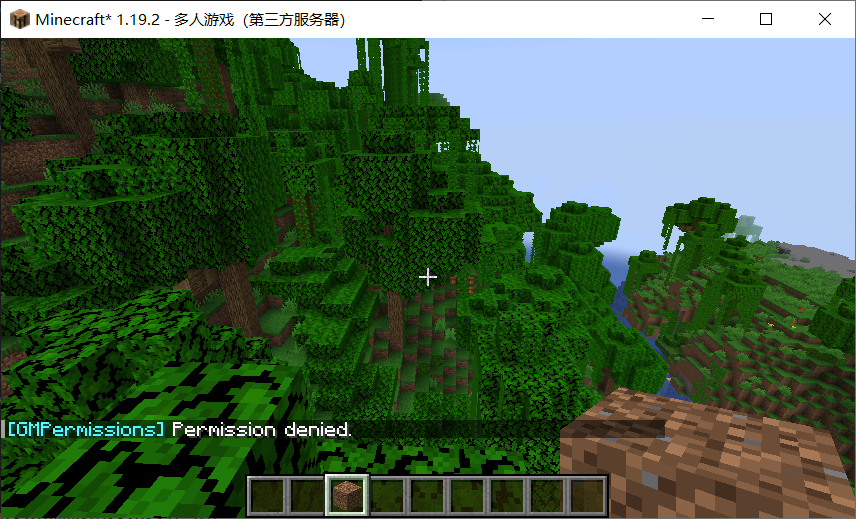

# Gamemode-Permissions
A Simple Bukkit/Spigot Plugin for Minecraft Server to specify permission nodes for each gamemode.

## Table of Contents

- [Why I made this](#why-i-made-this)
- [Install](#install)
- [Permissions](#permissions)
    - [(Key Point 1)](#key-point-1)
    - [Plain nodes](#plain-nodes)
    - [Wildcard nodes](#wildcard-nodes)
    - [Negative nodes](#negative-nodes)
        - [(Key Point 2)](#key-point-2)
    - [Operators](#operators)
- [Screenshots](#screenshots)
- [License](#license)

## Why I made this
I'm recently working on my Minecraft server, and I found it unable to deprive a permission group of the permission to switch to creative mode.   

(Because the Bukkit has only one permission node(`minecraft.command.gamemode`) for all gamemodes.)

I'm reluctant to use a plugin like `Essentials` because it's too heavy for my server. So I made this simple plugin.   

## Install

1. Install [GroupManager](https://github.com/ElgarL/GroupManager)   
    (The plugin is **also compatible** with `LuckPerms`. I haven't tested other permission plugins, but it should work.)  

2. Just put the plugin in your server's `plugin` folder and restart the server.  

## Permissions

  

<a id="key-point-1"></a>

Above all, **you should first** add the permission `minecraft.command.gamemode` to the target player/group so that the command `gamemode` can be used.  

### Plain nodes

| Permission nodes| Description | Command example |
|:---:|:---:|:---:|
| `minecraft.command.gamemode.survival` | Allows the **sender** to switch to **survival** mode. |`/gamemode survival`|
| `minecraft.command.gamemode.creative` | ~ **creative** mode. |`/gamemode creative`|
| `minecraft.command.gamemode.spectator` | ~ **spectator** mode. |`/gamemode spectator`|
| `minecraft.command.gamemode.adventure` | ~ **adventure** mode. |`/gamemode adventure`|
| `minecraft.command.gamemode.survival.player` | Allows the **sender** to set another player's gamemode to **survival** mode. |`/gamemode survival SomeBottle`|
| `minecraft.command.gamemode.creative.player` |  ~ **creative** mode.  |`/gamemode creative SomeBottle`|
| `minecraft.command.gamemode.spectator.player` | ~ **spectator** mode.  |`/gamemode spectator SomeBottle`|
| `minecraft.command.gamemode.adventure.player` | ~ **adventure** mode. |`/gamemode adventure SomeBottle`|

### Wildcard nodes

| Permission nodes| Description | Command example |
|:---:|:---:|:---:|
| `minecraft.command.gamemode.*` | Allows the **sender** to **have full access** to the command `gamemode`. |`/gamemode <survival|creative|spectator|adventure> [<target>]`|
| `minecraft.command.gamemode.survival.*` | Allows the **sender** to set any player's mode to **survival** |`/gamemode survival [<target>]`|
| `minecraft.command.gamemode.creative.*` | ~ **creative** |`/gamemode creative [<target>]`|
| `minecraft.command.gamemode.adventure.*` | ~ **adventure** |`/gamemode adventure [<target>]`|
| `minecraft.command.gamemode.spectator.*` | ~ **spectator** |`/gamemode spectator [<target>]`|  

### Negative nodes

Add a `^` (caret) in front of any permission node above to declare a negative permission node.  

For instance, if you want to give a player the full access to the command `gamemode`, but **deny** the player to switch to **creative** mode, you can add the following permission nodes to the player:  

```bash
minecraft.command.gamemode.*
# Deny the player to use /gamemode creative [<target>]
^minecraft.command.gamemode.creative.* 
```

Another example:

```bash
minecraft.command.gamemode.*
# Deny the player to use /gamemode survival
# But allows the player to use /gamemode survival <target>
^minecraft.command.gamemode.survival 
```

------

<a id="key-point-2"></a>

  

Notice that **the negative permission nodes** are prior to positive nodes!

Examples:

```bash
minecraft.command.gamemode.*
^minecraft.command.gamemode.*
# In this case, you can't use command /gamemode at all.
```

```bash
minecraft.command.gamemode.creative
^minecraft.command.gamemode.*
# In this case, you won't able to use command /gamemode creative
```

```bash
^minecraft.command.gamemode.survival.*
minecraft.command.gamemode.survival.player
# In this case, you are unable to use command /gamemode survival SomeBottle
```

### Operators

Server operators have **full permissions** to use `/gamemode` command by default.

## Screenshots

Trying to use `/gamemode` command without specific permission:

  

## License

Under [MIT License](./LICENSE).  

Thank you for using the plugin.  